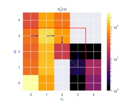
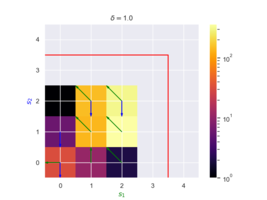

# Rom-Q

This repo contains my simulations for developing Rom-Q, a robust temporal difference learning algorithm for multi-agent systems. This project was developed during my research visit at the Intelligent and Autonomous Systems Group in CWI, under the supervision of Dr. Bloembergen and Dr. Kaisers.

The project contains a test-bed for evaluating the robustness of RL algorithms. The test-bed includes a simple load-balancing problem, where two nodes have the ability of executing and off-loading a task to the other node, actions that incur small costs. The objective of the team of nodes is to minimize the cost of their operation while avoiding an over-flow of their memory. Because attacks occur during deployment (but not during learning), classical Q-learning learns non-robust policies that are optimal under non attacks, but over-flow in the presence of them.

In this figure that shows the optimal policy under Q-learning and the state visits when attacks occur during deployment, we can see that visits often enter the over-flow area (separated by the safe area by a red line).

In contrast, the policy learned by Rom-Q remains in the safe area, even under attack:

You can find more information about the algorithm and simulations in the [report](material/report.pdf).

## How to use

The project was developed using Python 3.7.6.

To install all required libraries create a conda environment using:

`conda env create -f environment.yml`

File [experiment_network.py](source/experiment_network.py) is the main interface of the project. This script needs to be run under [the source directory](source). For example, the following call will simulate a simple network of two nodes having a capacity of 3 packets, where each node is an agent employing RomQ-learning for 100000 time steps in order to learn a robust policy. Results will be averaged over 10 independent trials and plots will be produced under folder "projects/myproject/plots".

`python3 experiment_network.py --project example_project --trials 10 --method RomQ --adversary RomQ --topology pair --capacity 3 --train_samples 1000000`

We can then evaluate the learned policy against adversarial attacks that occur with a pre-defined probability using the following command:

`python3 experiment_network.py --project example_project --trials 10 --method RomQ --adversary RomQ_determ --topology pair --capacity 3 --network_type D --eval_samples 10000 --evaluate --eval_attack_prob 1 --determ_execution --determ_adv`

The directory [scripts](scripts) contains bash scripts for running all simulations and producing all plots used in the report that accompanied this project.
