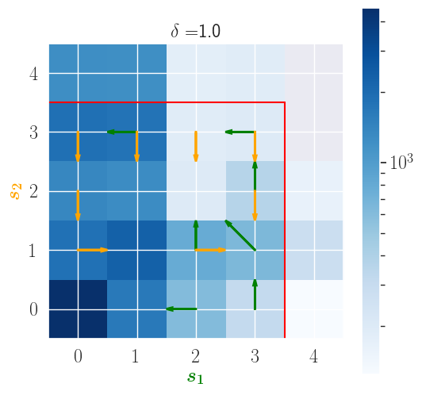
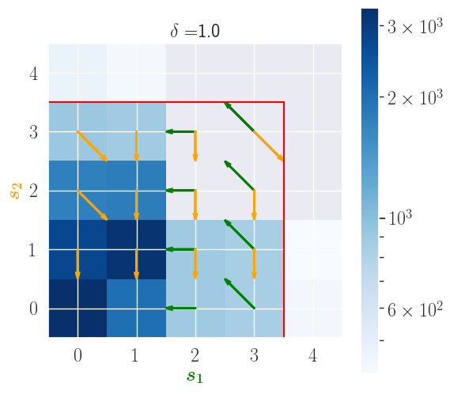

# RoM-Q

This repo contains the implementation of RoM-Q and simulations accompanying the [paper](material/paper.pdf). RoM-Q is a robust temporal difference learning algorithm for multi-agent systems. This project was developed during my research visit at the Intelligent and Autonomous Systems Group in CWI, under the supervision of Dr. Daan Bloembergen and Dr. Michael Kaisers.

The project contains a test-bed for evaluating the robustness of RL algorithms. The test-bed is a simple load-balancing problem, where two nodes have the ability of executing and off-loading a task to the other node, actions that incur small penalties. The objective of the team of nodes is to minimize the cost of their operation while avoiding an over-flow of their memory, which incurs a large penalty. Because attacks occur during evaluation (but not during training), classical Q-learning learns non-robust policies that are optimal under non attacks, but over-flow in the presence of them.

In this figure that shows the optimal policy under Q-learning and the state visits when attacks occur during evaluation, we can see that visits often enter the over-flow area (separated by the safe area by a red line).

In contrast, the policy learned by RoM-Q remains in the safe area, even under attack:

You can find more information about the algorithm and simulations in the [paper](material/paper.pdf).

## How to use

The code was written using Python 3.7.6. To install all required libraries create a conda environment using:

`conda env create -f environment.yml`

File [experiment_network.py](source/experiment_network.py) is the main interface of the project. This script needs to be run under [the source directory](source). For example, the following call will simulate a simple network of two nodes having a capacity of 3 packets, where each node is an agent employing RoM-Q for 100000 time steps in order to learn a robust policy. Results will be averaged over 10 independent trials and plots will be produced under folder "projects/example_project/plots".

`python3 experiment_network.py --project example_project --trials 10 --method RomQ --adversary RomQ --topology pair --capacity 3 --train_samples 1000000`

We can, then, evaluate the learned policy against adversarial attacks that occur with a pre-defined probability using the following command:

`python3 experiment_network.py --project example_project --trials 10 --method RomQ --adversary RomQ --topology pair --capacity 3 --network_type D --eval_samples 10000 --evaluate --eval_attack_prob 1`

## Reproducing simulations

The directory [simuls](projects/simuls) contains the simulations performed to produce the plots in the paper. Under it, you can find the configuration files and plots. Note that data (saved as pickle files) have not been uploaded due to memory constraints. To generate the data (if for instance you want to produce new plots) you need to rerun the simulations. The directory [scripts](scripts) contains bash scripts for rerunning all simulations and python files for producing all plots (and more) presented in the paper.
